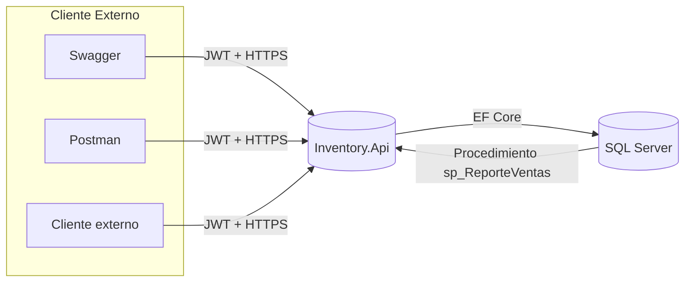
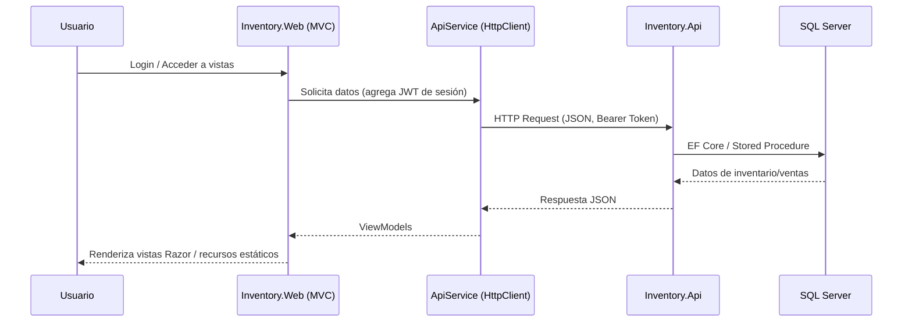

# InventorySuite

Sistema de gestión de inventario y ventas construido en .NET 8. La solución incluye una API REST protegida con JWT y un cliente MVC que consume la API para ofrecer operaciones diarias, reportes y exportes listos para negocio.


## Contenido
- [Arquitectura del proyecto](#arquitectura-del-proyecto)
- [Características principales](#características-principales)
- [Tecnologías](#tecnologías)
- [Requisitos previos](#requisitos-previos)
- [Configuración inicial](#configuración-inicial)
- [Ejecución](#ejecución)
- [Uso rápido](#uso-rápido)
- [Recursos y documentación](#recursos-y-documentación)
- [Estructura de carpetas](#estructura-de-carpetas)
- [Próximos pasos sugeridos](#próximos-pasos-sugeridos)

## Arquitectura del proyecto
- `Inventory.Api`: API REST en ASP.NET Core que expone autenticación, CRUD de productos, registro de ventas y reportes. Utiliza Entity Framework Core con SQL Server y ASP.NET Identity.
- `Inventory.Web`: cliente MVC que consume la API mediante `HttpClient`, maneja sesión con JWT y ofrece UI para la operación diaria, generación de PDF (QuestPDF) y Excel (ClosedXML).
- `docs/`: recursos adicionales como la colección de Postman y scripts SQL (incluye `sp_ReporteVentas.sql`).

### Diagrama Inventory.Api


### Diagrama Inventory.Web (MVC)


## Características principales
- Autenticación y registro de usuarios con ASP.NET Identity y JWT.
- CRUD completo de productos con validaciones y “soft delete”.
- Flujo de ventas interactivo con búsqueda por código, cálculos automáticos de IVA (13 %) y totales en frontend.
- Reporte consolidado de ventas con filtros por vendedor, exportable a PDF y Excel.
- Dashboard con métricas rápidas de productos y ventas del día.

## Tecnologías
- .NET SDK 8
- ASP.NET Core 8 (API + MVC)
- Entity Framework Core 8 + SQL Server
- ASP.NET Identity y JWT Bearer Authentication
- QuestPDF 2024, ClosedXML
- Bootstrap 5, jQuery, JavaScript vanilla para UI
- Swagger/OpenAPI para la documentación de la API

## Requisitos previos
- .NET SDK 8 instalado
- SQL Server (local o remoto) con acceso al usuario de desarrollo
- Opcional: `dotnet-ef` global tool para ejecutar migraciones
- Opcional: Postman para probar la API (`docs/InventorySuite.postman_collection.json`)

## Configuración inicial
1. Clonar el repositorio.
   ```bash
   git clone https://github.com/Alvarenga144/InventorySuite.git
   cd InventorySuite
   ```
2. Restaurar paquetes.
   ```bash
   dotnet restore
   ```
3. Configurar `appsettings.Development.json` en ambos proyectos:
   - `Inventory.Api/Inventory.Api/appsettings.Development.json`: actualizar la cadena de conexión `ConnectionStrings.Default` y (opcionalmente) los valores de `JwtSettings`.
   - `Inventory.Api/Inventory.Web/appsettings.Development.json`: apuntar `ApiSettings.BaseUrl` a la URL local donde correrá la API (por defecto `http://localhost:5084`).
4. Ejecutar migraciones de la API (requiere base de datos creada o permisos de creación).
   ```bash
   cd Inventory.Api/Inventory.Api
   dotnet ef database update
   cd ../..
   ```
5. Crear el procedimiento almacenado para reportes ejecutando `docs/sql/sp_ReporteVentas.sql` en la base de datos.

## Ejecución
En dos terminales distintos (o usando `dotnet watch`):

```bash
# API
dotnet run --project Inventory.Api/Inventory.Api

# Cliente MVC
dotnet run --project Inventory.Api/Inventory.Web
```

- API: `https://localhost:7084` (Swagger disponible en `/swagger` en entorno Development).
- Cliente MVC: `https://localhost:7200` (inicio por defecto en `/Account/Login`).

## Uso rápido
1. Registrarse desde el cliente MVC (o vía API) para generar el primer usuario.
2. Iniciar sesión y gestionar productos (`Productos > Crear`). Sin productos el flujo de ventas no mostrará resultados.
3. Registrar ventas (`Ventas > Crear`) usando códigos de producto; el frontend calcula IVA y totales antes de enviar.
4. Consultar el dashboard para ver métricas o usar `Reportes` para filtrar por vendedor y exportar a PDF/Excel.

## Recursos y documentación
- Swagger UI de la API: `https://localhost:7084/swagger`
- Colección Postman: `docs/InventorySuite.postman_collection.json`
- Script SQL del reporte: `docs/sql/sp_ReporteVentas.sql`

## Estructura de carpetas
```
InventorySuite/
├─ Inventory.Api/
│  ├─ Inventory.Api/          # Proyecto Web API (.csproj)
│  └─ Inventory.Web/          # Proyecto MVC cliente (.csproj)
├─ docs/
│  ├─ InventorySuite.postman_collection.json
│  └─ sql/
│     └─ sp_ReporteVentas.sql
└─ README.md
```

## Próximos pasos sugeridos
- Agregar datos iniciales (seed) para ambientes de pruebas.
- Incorporar pruebas automatizadas (unitarias e integrales).
- Preparar scripts de despliegue/CI y documentación para entornos productivos.